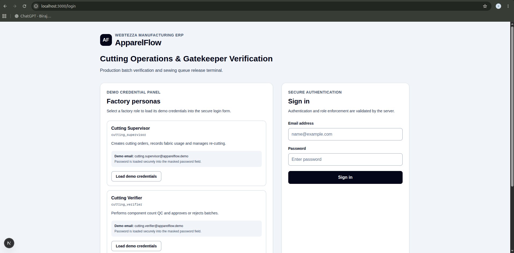
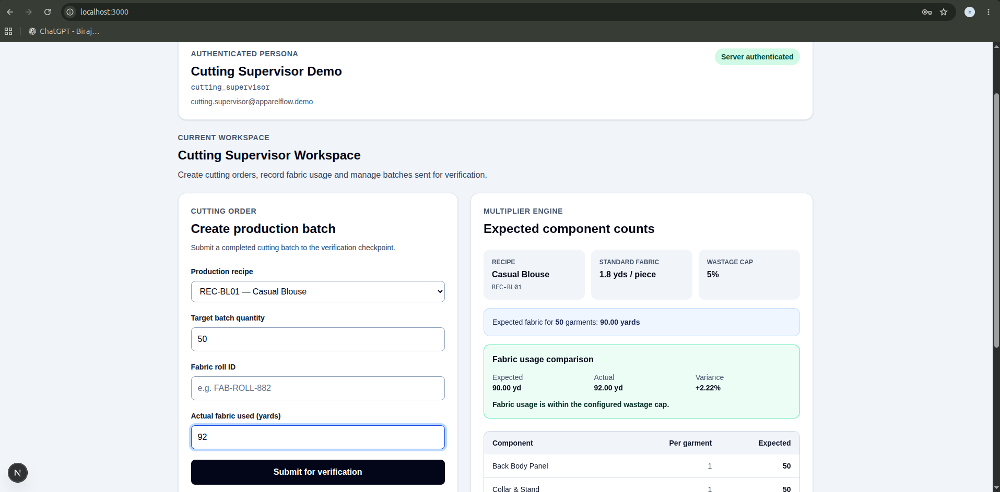
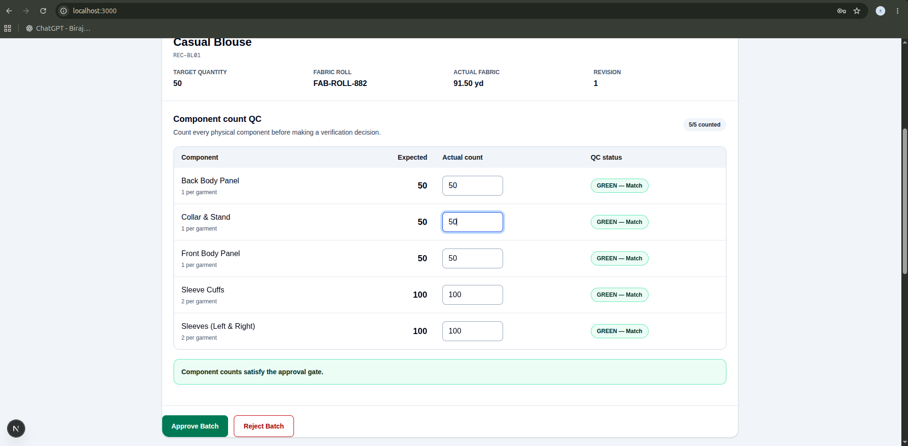
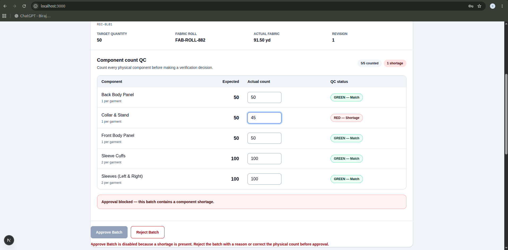
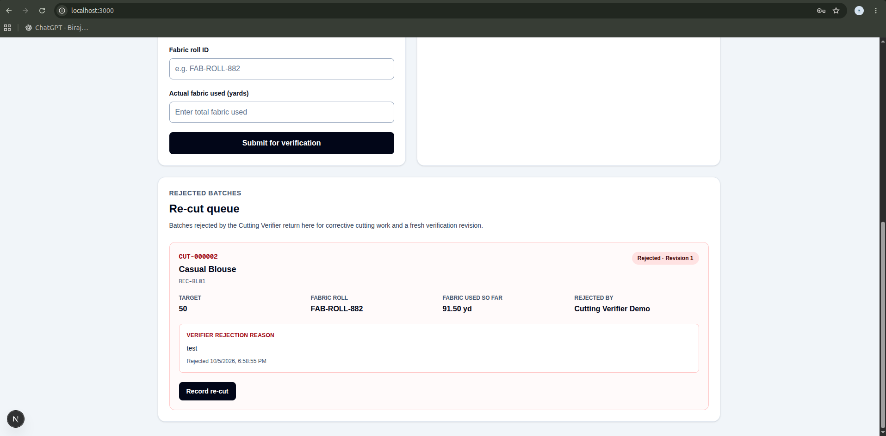

# ApparelFlow ERP

ApparelFlow ERP is a full-stack garment-production execution system implementing the **Cutting Operations & Gatekeeper Verification Terminal** from the Webtezza Software Engineering Intern practical assessment.

The application enforces a manufacturing hard stop: a cutting batch cannot enter sewing unless every required component has been counted, no shortage exists, and an authenticated Cutting Verifier has approved the batch.

The critical production gate is enforced on the server and database-backed workflow rather than relying only on disabled buttons or hidden UI controls.

## Live Application

**Production URL:** Pending final Vercel deployment.

**GitHub Repository:**
https://github.com/birajithk/apparelflow-erp

## Assessment Scope

The project focuses on three factory roles:

| Role | Main Responsibility |
|---|---|
| Cutting Supervisor | Creates cutting batches, records fabric usage, and handles rejected batches requiring re-cutting |
| Cutting Verifier | Performs independent component-count QC and approves or rejects batches |
| Sewing Supervisor | Receives verified batches and starts sewing assembly |

The project intentionally implements this production checkpoint rather than the complete ApparelFlow ERP platform.

## Implementation Status

| Area | Status |
|---|---|
| Authentication | Implemented |
| Server-side sessions | Implemented |
| Server-side RBAC | Implemented |
| Production recipe seeding | Implemented |
| Cutting order creation modal | Implemented |
| Component multiplier engine | Implemented |
| Immediate input validation | Implemented |
| Verification terminal | Implemented |
| GREEN / YELLOW / RED traffic lights | Implemented |
| Server-side shortage hard stop | Implemented |
| Approval and rejection workflow | Implemented |
| Immutable verification audit trail | Implemented |
| Rejected batch re-cut workflow | Implemented |
| Fabric wastage calculation | Implemented |
| Verified-only Sewing Queue | Implemented |
| Start Sewing Assembly | Implemented |
| Automated tests | 37 passing |
| AI optimization report | Complete |
| Production dependency audit | 0 vulnerabilities |
| Public deployment | Pending final Vercel deployment |

## Screenshots

### Demo Login



The application provides demo credentials for each factory role so evaluators can test role isolation and the complete production workflow.

### Cutting Supervisor



The Cutting Supervisor creates production batches from seeded garment recipes.

The system automatically calculates expected component quantities using:

```text
Expected Quantity =
Target Garment Quantity × Pieces Per Garment
```

The supervisor records the fabric roll and actual fabric usage before submitting the batch to verification.

### Cutting Verifier — Valid Counts



The Cutting Verifier records physical component counts.

Traffic-light status is calculated in real time:

```text
GREEN  → Actual Quantity = Expected Quantity
YELLOW → Actual Quantity > Expected Quantity
RED    → Actual Quantity < Expected Quantity
```

GREEN and YELLOW components may satisfy the approval gate.

### Server-Enforced Shortage Hard Stop



Any component shortage is marked RED.

A batch containing any RED component cannot be approved. The UI disables approval, and the backend independently rejects illegal approval attempts.

### Rejected Batch Re-Cut



Rejected batches return to the Cutting Supervisor.

The re-cut workflow records additional fabric usage and a corrective-action reason, increments the batch revision, resets component counts, and sends the corrected batch through a fresh verification cycle.

Earlier verification records remain immutable.

## Manufacturing Workflow

```text
CUTTING_IN_PROGRESS
        |
        v
PENDING_VERIFICATION
        |
        v
Component Count QC
        |
        +-----------------------------+
        |                             |
        v                             v
     REJECTED                      VERIFIED
        |                             |
        v                             v
 Cutting Supervisor              Sewing Queue
        |                             |
        v                             v
 Re-cut / Resubmit            Start Sewing Assembly
        |                             |
        +------> New Revision         v
                                  IN_SEWING
```

## Production Gate Rules

For every recipe component:

```text
GREEN  → Actual == Expected
YELLOW → Actual > Expected
RED    → Actual < Expected
```

Approval requires all required components to have valid saved counts.

Approval is rejected when:

- any required component is missing;
- any component is uncounted;
- any component has RED shortage status;
- the user is not an authenticated Cutting Verifier;
- the order is not currently awaiting verification.

YELLOW excess counts are recorded but do not automatically block approval.

The backend performs these checks even if the frontend is bypassed.

## Seeded Production Recipes

### Casual Blouse — `REC-BL01`

| Attribute | Value |
|---|---|
| Category | Blouse |
| Standard Fabric | 1.8 yards / garment |
| Wastage Cap | 5.0% |

| Component | Pieces per Garment |
|---|---:|
| Front Body Panel | 1 |
| Back Body Panel | 1 |
| Sleeves (Left & Right) | 2 |
| Collar & Stand | 1 |
| Sleeve Cuffs | 2 |

### Crop Top — `REC-CT02`

| Attribute | Value |
|---|---|
| Category | Crop Top |
| Standard Fabric | 1.1 yards / garment |
| Wastage Cap | 8.0% |

| Component | Pieces per Garment |
|---|---:|
| Front Chest Panel | 1 |
| Back Support Panel | 1 |
| Neck Binding Strip | 1 |
| Hem Elastic Casing | 1 |
| Side Strap Accents | 2 |

## Fabric Wastage

Expected fabric usage is derived from the production recipe:

```text
Expected Fabric =
Target Quantity × Standard Fabric per Garment
```

The backend calculates verification-time fabric wastage as:

```text
Wastage % =
((Actual Fabric Used - Expected Fabric) / Expected Fabric) × 100
```

The resulting percentage is stored with the immutable verification audit.

The UI also normalizes insignificant JavaScript floating-point representation noise so mathematically equal fabric values display `0.00%` rather than `-0.00%`.

## Architecture

ApparelFlow uses a layered full-stack architecture:

```text
Browser / React UI
        |
        v
Next.js App Router
        |
        v
API Route Handlers
        |
        v
Authentication + RBAC Guards
        |
        v
Server-only Domain Services
        |
        v
PostgreSQL / Neon
```

Security-sensitive business rules are implemented in server-only services.

The browser is treated as an interface rather than an authorization boundary.

Detailed architecture documentation is available at:

[`docs/ARCHITECTURE.md`](docs/ARCHITECTURE.md)

## Technology Stack

| Layer | Technology |
|---|---|
| Framework | Next.js 16 App Router |
| Frontend | React 19 |
| Language | TypeScript |
| Styling | Tailwind CSS |
| Database | PostgreSQL |
| Cloud Database | Neon |
| Database Driver | `pg` |
| Authentication | Server-side database sessions |
| Password Hashing | `bcryptjs` |
| Tests | Vitest |
| Deployment Target | Vercel |

## Database Model

### `users`

Stores authenticated factory users, password hashes, names, and factory roles.

### `sessions`

Stores hashed server-side authentication tokens and expiration timestamps.

### `recipes`

Stores garment production recipes, categories, standard fabric usage, and wastage caps.

### `recipe_components`

Stores required production components and pieces-per-garment multipliers.

The schema also includes the assessment-required `image_url` field.

### `cutting_orders`

Stores production batches including recipe, target quantity, fabric roll, cumulative actual fabric usage, production status, revision number, creator, and manufacturing timestamps.

### `cutting_fabric_entries`

Stores original and re-cut fabric consumption entries so corrective cutting does not overwrite earlier fabric history.

### `verification_items`

Stores the current expected quantity, actual quantity, and GREEN / YELLOW / RED state for each component.

### `verification_logs`

Stores immutable verification decisions including:

- authenticated verifier ID;
- batch revision;
- APPROVED / REJECTED decision;
- rejection reason when applicable;
- fabric usage snapshot;
- wastage percentage;
- server/database decision timestamp.

### `verification_log_items`

Stores immutable component snapshots for each verification decision including:

- component ID;
- expected quantity;
- actual quantity;
- traffic-light status;
- count variance.

The database enforces:

```text
variance = actual_qty - expected_qty
```

## Security Design

Security-sensitive decisions are enforced on the server.

Protected endpoints authenticate the active session and require the appropriate role before executing business operations.

```text
POST /api/cutting/orders
Role: cutting_supervisor

POST /api/cutting/recut
Role: cutting_supervisor

PATCH /api/verification/count
Role: cutting_verifier

POST /api/verification/decision
Role: cutting_verifier

GET /api/sewing/queue
Role: sewing_supervisor

POST /api/sewing/start
Role: sewing_supervisor
```

Verifier and Sewing Supervisor identity are derived from the authenticated server session and are never trusted from client request bodies.

Verification timestamps are generated from trusted server/database context.

### Sewing Queue Isolation

The Sewing Queue database query explicitly filters:

```sql
WHERE co.status = 'VERIFIED'
```

Pending, rejected, unverified, and already-started batches cannot be exposed merely by changing URL parameters.

### Immutable Audit Records

Verification decisions and component snapshots are protected against application-level update or deletion using PostgreSQL triggers.

Re-cutting creates a new verification revision rather than overwriting historical evidence.

## Defensive Validation

Target garment quantities and verification component counts require integer values where appropriate.

The application rejects invalid values such as:

```text
-1
2.5
abc
1e2
```

Component count `0` is valid because it represents a real physical count and correctly produces RED when the expected quantity is greater than zero.

Fabric measurements intentionally support positive decimal values because fabric is measured in yards.

Forms provide immediate inline error feedback.

## Demo Accounts

| Role | Email | Password |
|---|---|---|
| Cutting Supervisor | `cutting.supervisor@apparelflow.demo` | `cutting.supervisor@2026` |
| Cutting Verifier | `cutting.verifier@apparelflow.demo` | `cutting.verifier@2026` |
| Sewing Supervisor | `sewing.supervisor@apparelflow.demo` | `sewing.supervisor@2026` |

These credentials are intentionally included for assessment evaluation.

## Local Development

### Install dependencies

```bash
npm install
```

### Configure environment variables

Create `.env.local` from `.env.example`.

```env
DATABASE_URL="postgresql://..."
DIRECT_DATABASE_URL="postgresql://..."
```

`DATABASE_URL` is used by the running application.

`DIRECT_DATABASE_URL` is used for database migrations and seed scripts.

Never commit real database credentials.

### Run database migrations

```bash
npm run db:migrate
```

### Seed demo users

```bash
npm run db:seed:users
```

Production recipes are installed through the database migrations.

### Start development server

```bash
npm run dev
```

Open:

```text
http://localhost:3000
```

## Automated Tests

Run the complete automated test suite with:

```bash
npm test
```

Current result:

```text
Test Files  8 passed
Tests       37 passed
```

Mandatory assessment coverage includes:

1. All-GREEN components can be approved by an authenticated Cutting Verifier.
2. A RED shortage component blocks approval.
3. Rejection without a reason is rejected.
4. A non-verifier receives `403 Forbidden` when attempting verification.
5. Unapproved orders cannot appear in the Sewing Queue database query.

Additional tests cover YELLOW approval, missing and uncounted components, sewing-start safeguards, malformed requests, identity-spoof prevention, re-cut API validation, verification count parsing, and fabric-variance regression.

## Quality Checks

Before submission the application is checked with:

```bash
npm test
npx tsc --noEmit
npm run lint
npm run build
git diff --check
```

The latest local verification passes all of these checks.

## Dependency Security

Production dependencies currently report:

```text
npm audit --omit=dev
0 vulnerabilities
```

The full dependency tree contains a known development-only ESLint/glob advisory.

The finding and mitigation decision are documented at:

[`docs/SECURITY_NOTES.md`](docs/SECURITY_NOTES.md)

A forced breaking dependency downgrade was intentionally not applied.

## AI-Assisted Engineering

The project used AI-assisted development, but generated output was reviewed and hardened rather than accepted blindly.

The report documents real issues discovered during development, including:

- a PostgreSQL NULL/CHECK constraint weakness;
- an inline order form that did not satisfy the required modal workflow;
- floating-point `-0.00%` fabric variance;
- verifier draft/server state synchronization.

See:

[`AI_OPTIMIZATION_REPORT.md`](AI_OPTIMIZATION_REPORT.md)

## Assessment Compliance

The project requirements checklist is maintained at:

[`REQUIREMENTS_CHECKLIST.md`](REQUIREMENTS_CHECKLIST.md)

It tracks the assessment requirements, completed functionality, and final deployment checks.

## Project Structure

```text
apparelflow-erp/
├── AI_OPTIMIZATION_REPORT.md
├── REQUIREMENTS_CHECKLIST.md
├── README.md
├── database/
│   └── migrations/
│       ├── 001_initial_schema.sql
│       ├── 002_harden_verification_constraints.sql
│       ├── 003_seed_production_recipes.sql
│       └── 004_cutting_order_number_sequence.sql
├── docs/
│   ├── ARCHITECTURE.md
│   ├── SECURITY_NOTES.md
│   └── screenshots/
├── scripts/
│   ├── migrate.mjs
│   └── seed-demo-users.mjs
├── src/
│   ├── app/
│   │   ├── api/
│   │   ├── login/
│   │   └── page.tsx
│   ├── components/
│   │   ├── auth/
│   │   ├── cutting/
│   │   ├── sewing/
│   │   └── verification/
│   ├── lib/
│   └── server/
│       ├── auth/
│       ├── cutting/
│       ├── db/
│       ├── recipes/
│       ├── sewing/
│       └── verification/
├── tests/
│   ├── cutting/
│   ├── sewing/
│   └── verification/
└── package.json
```

## Engineering Principles

The implementation follows several defensive engineering rules:

- authentication decisions are server-controlled;
- roles are enforced by backend guards;
- frontend visibility is not authorization;
- manufacturing state transitions are server-controlled;
- database transactions protect multi-step state changes;
- audit identities and timestamps come from trusted server context;
- verification evidence is immutable;
- rejected batches create fresh revisions rather than destroying history;
- Sewing Queue eligibility is enforced at the database-query level;
- database constraints provide defense in depth.

The goal is not only to display the manufacturing workflow, but to make invalid production transitions non-bypassable.